<div align="center">

<picture>
  <source media="(prefers-color-scheme: dark)" srcset="assets/logo/harbor-lockup-dark.svg">
  
</picture>

### Point it at a simulator. Describe a task. Get a trained policy.

HARBOR automates robot reinforcement learning from an engineering workflow into a request.<br>
It sets up the simulation, writes the task, designs the reward, wires the algorithm,<br>
trains the policy — and checks its own work at every step.

[](https://arxiv.org/abs/2606.08610)
[](https://supersglzc.github.io/harbor-rl)
[](LICENSE)
[](https://claude.com/claude-code)
[](../../actions)
[](https://discord.gg/W3ywA3jUKs)

**[Quickstart](#quickstart)** · **[Gallery](#gallery)** · **[Inside HARBOR](#inside-harbor)** · **[Docs](https://supersglzc.github.io/harbor-rl)** · **[Paper](https://arxiv.org/abs/2606.08610)** · **[Discord](https://discord.gg/W3ywA3jUKs)** · **[Cite](#citation)**

<br>


</div>

## What is HARBOR

Reinforcement learning works. The pipeline around it is what costs weeks — building the task, shaping the reward, tuning hyperparameters, and re-doing all of it for the next simulator.

HARBOR is a **harness**: a structured execution environment that decomposes that pipeline into bounded stages, hands each to a specialized agent, and refuses to advance until an **executable gate** proves the stage actually worked. Rollouts, reward curves, and rendered video are the evidence. Nothing is taken on the agent's word.

The result is not a black box. Every stage writes inspectable artifacts — code, configs, logs, checkpoints, video — and pauses at a gate you can audit, correct, and resume from.

```
prompts ──▶ dependency ──▶ RL integration ──▶ task ──▶ reward ──▶ training ──▶ policy
                │                │             │         │           │
                └────────────────┴─────────────┴─────────┴───────────┘
                         every arrow is a gate that can fail
```

<a id="gallery"></a>

## One harness, different tasks · robots · simulators

The same task descriptions, given to HARBOR against different simulator codebases. It adapts to each one's APIs, asset formats, and contact model while preserving the task and reward intent — and the harness is embodiment-agnostic, so whole-body locomotion goes through exactly the same pipeline as tabletop manipulation.

<table>
<tr>
  <th align="left" width="118">&nbsp;</th>
  <th align="center">IsaacLab</th>
  <th align="center">ManiSkill</th>
  <th align="center">Genesis</th>
</tr>
<tr>
  <td><b>Stack&#8209;Cube</b><br><sub>long-horizon<br>composition</sub></td>
  <td>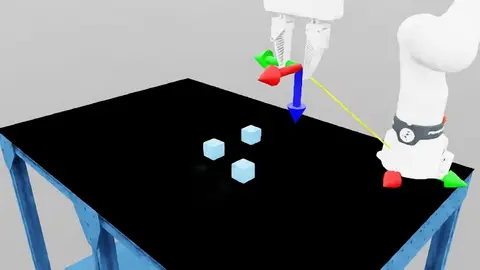</td>
  <td>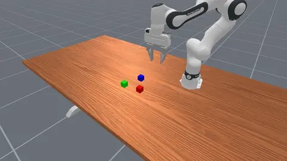</td>
  <td></td>
</tr>
<tr>
  <td><b>Insert&#8209;Drawer</b><br><sub>articulated<br>interaction</sub></td>
  <td>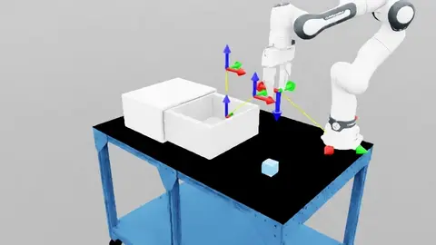</td>
  <td></td>
  <td>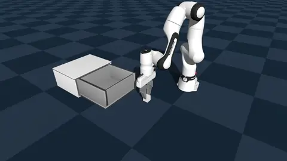</td>
</tr>
<tr>
  <td><b>Lift&#8209;Box</b><br><sub>bimanual<br>coordination</sub></td>
  <td></td>
  <td></td>
  <td>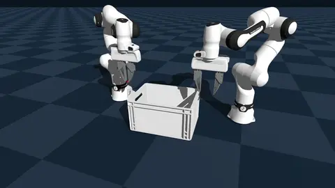</td>
</tr>
<tr>
  <td><b>Hang&#8209;Mug</b><br><sub>precise<br>placement</sub></td>
  <td>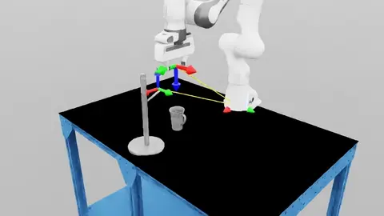</td>
  <td>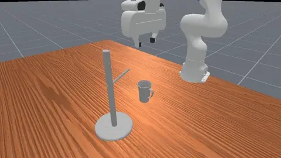</td>
  <td>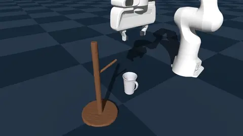</td>
</tr>
<tr>
  <td><b>Dex&#8209;Grasp</b><br><sub>dexterous<br>control</sub></td>
  <td>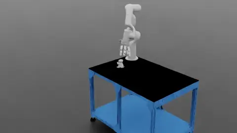</td>
  <td></td>
  <td>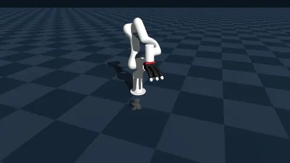</td>
</tr>
<tr>
  <td><b>G1&nbsp;Jump</b><br><sub>whole-body<br>dynamics</sub></td>
  <td></td>
  <td>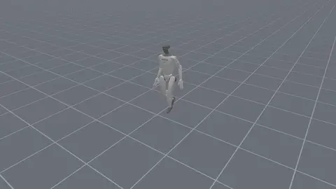</td>
  <td>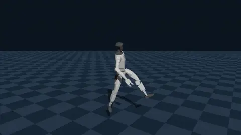</td>
</tr>
<tr>
  <td><b>G1&nbsp;Footstep</b><br><sub>contact<br>scheduling</sub></td>
  <td>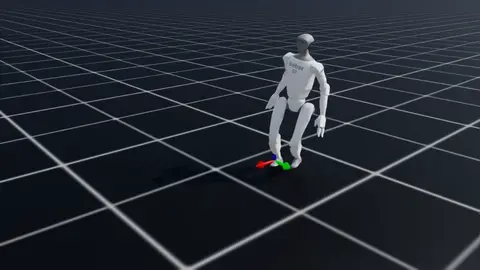</td>
  <td>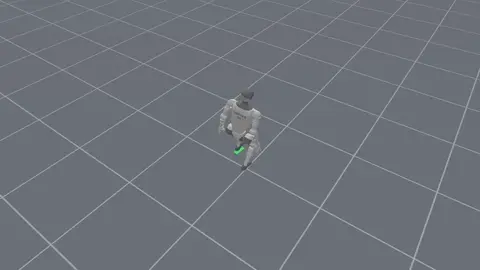</td>
  <td>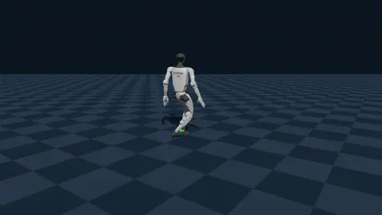</td>
</tr>
<tr>
  <td><b>G1&nbsp;Bridge&nbsp;Cross</b><br><sub>narrow<br>traverse</sub></td>
  <td>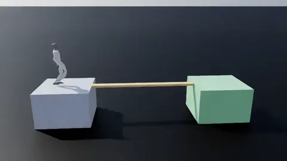</td>
  <td>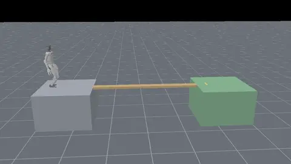</td>
  <td>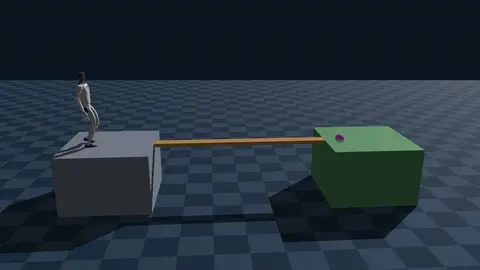</td>
</tr>
<tr>
  <td><b>G1&nbsp;Kick&nbsp;Ball</b><br><sub>dynamic<br>contact</sub></td>
  <td></td>
  <td>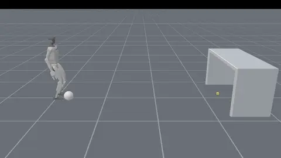</td>
  <td>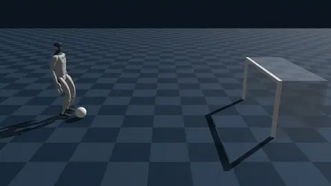</td>
</tr>
<tr>
  <td><b>G1&nbsp;Plum&nbsp;Piles</b><br><sub>discrete<br>footholds</sub></td>
  <td>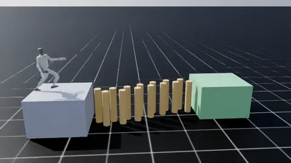</td>
  <td>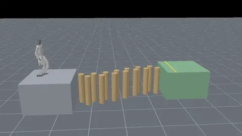</td>
  <td>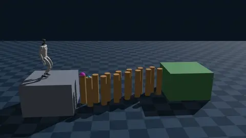</td>
</tr>
</table>

## Quickstart

### 1. Install

HARBOR is a [Claude Code](https://claude.com/claude-code) plugin and needs Claude Code **≥ 2.1.219**. Inside Claude Code:

```text
/plugin marketplace add supersglzc/harbor-rl
/plugin install harbor@harbor
```

`/harbor:help` lists the full surface.

That is the whole install. HARBOR installs [`uv`](https://docs.astral.sh/uv/) on first use if the host lacks it, and every Python dependency goes into the target repository's own `.venv/` — your system Python is never touched. See the [installation guide](https://supersglzc.github.io/harbor-rl/guide/install) for GPU driver requirements and troubleshooting.

### 2. Ask HARBOR to build a task

Point HARBOR at a Python simulation repository and describe what you want. It handles the rest.

```text
/harbor:task-create Set up the env for https://github.com/isaac-sim/IsaacLab, then create a task where
a Franka pushes a 5 cm block to a target marker. Success is block-to-marker
distance under 5 cm.
```

<details>
<summary><b>What a full run produces</b></summary>

```
<your-repo>/
├── .venv/                                  uv-managed environment
└── harbor/
    ├── dependency-generator/               setup_uv.sh, probe.json, install.md
    ├── benchmark-generator/                benchmark-spec.json, benchmark.md, task_overview.md
    ├── rl-integration-generator/           rl-suite-spec.json, rl-integration.md
    ├── create-task/<task>/                 task-history.md, test-checklist.md, smokes/, keyframes
    ├── scripts/rl/<impl>/                  train.py, eval.py, render.py, env_wrapper.py
    ├── configs/rl/                         ppo.yaml, sac.yaml, td3.yaml
    └── outputs/<algo>_<task>_<ts>/         checkpoint, metrics.jsonl, curves/, render.mp4
```

Every one of those files is meant to be read, edited, and re-run by hand.

</details>

### 3. Run the stages manually

You can also drive each stage yourself:

```text
/harbor:env-install-uv                     # probe deps, build .venv/, run the import smoke
/harbor:task-create name=Isaac-Push-Block-Franka-v0 \
    description="Franka pushes a 5 cm wooden block to a target marker; \
                 success when xy distance < 5 cm; horizon 200 steps."
/harbor:rl-run task=Isaac-Push-Block-Franka-v0 algorithm=ppo
/harbor:rl-render checkpoint=harbor/outputs/ppo_Isaac-Push-Block-Franka-v0_.../checkpoint.pt
```

Everything HARBOR generates lands inside the target repository under `harbor/`, so a second benchmark is just the same pipeline run again.

## Inside HARBOR

HARBOR is both an **end-to-end robot RL workflow** and a **structured agentic harness**. The first defines what it can do; the second defines how it does that work reliably.

### Capabilities

Each of these is one request. HARBOR can chain them end to end, or you can invoke any of them on its own.

| Capability | |
|:--|:--|
| **Install a simulator** | Probes the repository, builds an isolated `.venv/`, and verifies it imports and sees your GPU. `/harbor:env-install-uv` |
| **Design a task** | Turns a sentence into simulator-native task code — scene, actions, reset, success predicate, observations — each section gated by its own smoke. `/harbor:task-create name=<id> description="..."` |
| **Tune a reward** | Searches reward designs with real training as the fitness function; the winner is promoted onto the task. `/harbor:reward-tune task=<id>` |
| **Write an RL algorithm** | Scaffolds train, eval, render, configs and logging — from a self-contained algorithm tree, SB3, or your own implementation. Run by `/harbor:task-create`, or dispatch `rl-integration-generator` |
| **Train a policy** | Runs training with any config key overridable inline, and renders the result on success. `/harbor:rl-run task=<id> algorithm=ppo` |
| **Tune an algorithm** | Searches hyperparameters open-endedly, rejecting any candidate that costs more than 1.5× the running best in wall-clock without beating it by 10%. `/harbor:rl-tune task=<list> algorithm=<list>` |
| **Plot training curves** | Mean ± std W&B curves, multi-panel by task × baseline, averaging seeds within each pair. `/harbor:plot spec=<yaml>` |
| **Reproduce a task** | Extracts a task into a portable spec with verbatim code, then rebuilds it from that spec. `/harbor:probe-task task=<id>` then `/harbor:task-create from=<spec>` |

The same workflow applies across manipulation, dexterous control, and whole-body locomotion.

Behind these sits the full command and agent surface, including the primitives the capabilities above compose. See the **[command reference →](https://supersglzc.github.io/harbor-rl/guide/commands)** for every command and its arguments, the **[agent reference →](https://supersglzc.github.io/harbor-rl/guide/agents)** for each agent's role and tools, and the **[task library →](https://supersglzc.github.io/harbor-rl/guide/task-library)** for the tasks already authored.

### Architecture

HARBOR specializes a general agentic harness to robot RL as five interacting pieces:

| | |
|:--|:--|
| **Agents** | Context-isolated subprocesses, one bounded stage each. `reward-tuning-agent` designs candidates and dispatches one `reward-candidate-agent` per candidate, so a candidate's traceback never reaches the context deciding what to try next. |
| **Commands** | Reproducible operations, callable by any agent or by you. `rl-sweep` calls `rl-run` once per trial; `task-create` calls `reward-tune` for §6; `test` drives the whole chain. |
| **Artifacts** | Workflow state in files, not context. `benchmark-spec.json` is written once and read by every later stage; `tune-state.json` checkpoints each iteration, so a killed tune resumes from disk. |
| **Gates** | Executable checks that decide whether a stage advances, returning a diagnosis rather than a stack trace. §2 asserts the achieved joint position matches the commanded one; §6 asserts the terms sum back to the reward every step. |
| **Knowledge** | Templates, references, and append-only ledgers that accumulate across runs. Authoring searches a library of prior task specs first, so a new task starts from the closest one rather than a blank file. |

## Documentation

| | |
|:--|:--|
| [Getting started](https://supersglzc.github.io/harbor-rl/guide/) | What HARBOR is, installation, and your first benchmark. |
| [Workflows](https://supersglzc.github.io/harbor-rl/guide/end-to-end) | The end-to-end run, then authoring tasks, tuning rewards, and training. |
| [Concepts](https://supersglzc.github.io/harbor-rl/guide/harness) | The harness, gates, semantic correctness, context optimization, and your workspace. |
| [Reference](https://supersglzc.github.io/harbor-rl/guide/commands) | Every command, every agent, and the task library — generated from the source. |

## Contributing

Questions and discussion happen on [Discord](https://discord.gg/W3ywA3jUKs). Issues and pull requests are welcome — see [CONTRIBUTING.md](CONTRIBUTING.md). The fastest way to help is to run HARBOR on a simulator we have not covered and file what broke: the harness improves by accumulating exactly that kind of experience.

## Citation

```bibtex
@article{li2026harbor,
  title   = {HARBOR: A Harness Framework for Agentic Robot Reinforcement Learning},
  author  = {Li, Zechu and Jin, Yufeng and Liu, Xiaoyang and Liu, Puze and
             Prasad, Vignesh and D'Eramo, Carlo and Chalvatzaki, Georgia},
  journal = {arXiv preprint arXiv:2606.08610},
  year    = {2026}
}
```

## License

[Apache 2.0](LICENSE). Copyright 2026 The HARBOR Authors.

Parts of HARBOR are derived from PQL and LocoMuJoCo (both MIT), and the task library reproduces
code excerpts from Isaac Lab (BSD-3-Clause) and ManiSkill (Apache-2.0). Their notices are
retained in [THIRD_PARTY_NOTICES.md](THIRD_PARTY_NOTICES.md).
